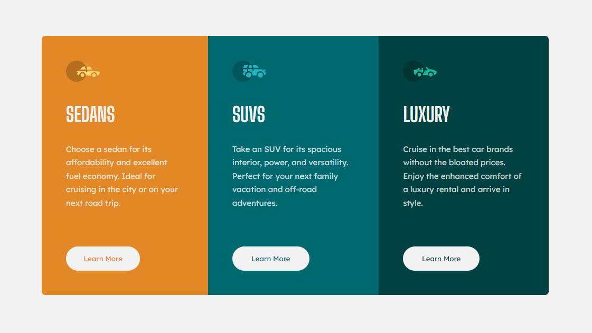

# Frontend Mentor - 3-column preview card component solution

This is a solution to the [3-column preview card component challenge on Frontend Mentor](https://www.frontendmentor.io/challenges/3column-preview-card-component-pH92eAR2-).

## Links

- [GitHub](https://github.com/avsecam/FM-3Column)
- [Live Site](https://avsecam.github.io/FM-3Column/)

## Built with

- HTML
- CSS with SCSS

## Author

- Frontend Mentor - [@avsecam](https://www.frontendmentor.io/profile/avsecam)
